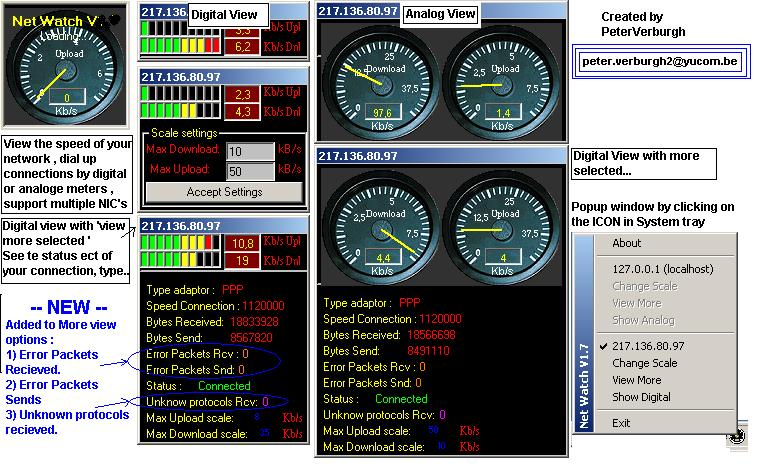



## Net Watch V2\.1 updated \! Measure connection \(internet\) speed REAL TIME\!

### Description

Net Watch V2.1(UPDATED)  

----

 

UPdate 18/01 : Download / upload correction scale

Bug fixed setting upload/download 

Try the application out !!  

 

Bugs fixed , less overhead...  

With this application you can see the data transfer on the adapters ( IP's )installed by your system. (including localhost!) 

It will be visualized by an analoge/digital meters, you can see the adaptor type , connection speed , bytes recieved & sends. 

You can also see the datatrafer/seconds. 

By clicking on the ICON in tray , it will display an popupwindow ... 

By clicking on the IP's in the popupwindow you can show or hide the analoge/digital meter.

You can input the maximum speed for upload & download in kB, then the scale will be automatic resized by using a control.

So if u are using example 1 networkcard & dial up modem or adsl , you can see per IP (adaptor) the speed , connection , connectionstatus ect.. 

 

By clicking on the 'Change scale ' it wil show or hide the scale partsettings. 

By Clicking on the 'View more' it will show/hide the additional information about the ip adapter. 

By Clicking on Digital/analoge it will change the skin ! 

 

----

Please VOTE for ME !! 

----

 

 

if you have idea's to upgrade , problem , please email me !!

 

 

Greetings,

Peter Verburgh.
 
### More Info
 

             |
---                |---
**Submitted On**   |2002-01-18 22:28:50
**By**             |[Peter V\.](https://github.com/Planet-Source-Code/PSCIndex/blob/master/ByAuthor/peter-v.md)
**Level**          |Intermediate
**User Rating**    |4.9 (568 globes from 117 users)
**Compatibility**  |VB 5\.0, VB 6\.0
**Category**       |[Complete Applications](https://github.com/Planet-Source-Code/PSCIndex/blob/master/ByCategory/complete-applications__1-27.md)
**World**          |[Visual Basic](https://github.com/Planet-Source-Code/PSCIndex/blob/master/ByWorld/visual-basic.md)
**Archive File**   |[Net\_Watch\_496661182002\.zip](https://github.com/Planet-Source-Code/peter-v-net-watch-v2-1-updated-measure-connection-internet-speed-real-time__1-25752/archive/master.zip)

